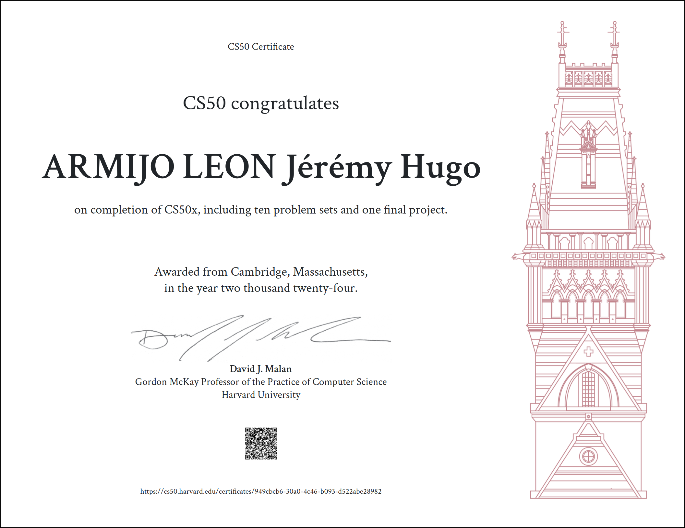

# CS50X
<p align="center">

</p>

<h1 align="center">
Harvard CS50's Introduction to Computer Science - CS50x 2024
</h1>

<p align="center">
  <a href="https://cs50.harvard.edu/python/2022/">Course Link</a>
</p>

<a href="certificate">
  
</a>
Here's a sample README for the CS50x course completion:

---

## Overview of CS50x

CS50x is Harvard University's introductory course to computer science, designed to teach fundamental concepts and skills required to pursue programming and problem-solving in a variety of fields. The course covers a broad range of topics, including algorithms, data structures, software development, web programming, and more. It uses multiple programming languages such as C, Python, SQL, HTML/CSS, and JavaScript to help students develop a strong foundation in computer science.

### Topics Covered
- **C Programming**: Understanding how memory, pointers, and data structures work at a low level.
- **Algorithms and Data Structures**: Learning fundamental algorithms for searching, sorting, and problem-solving, along with common data structures like arrays, linked lists, stacks, and queues.
- **Web Programming**: Introduction to web development using HTML, CSS, JavaScript, and Python to create dynamic websites.
- **SQL and Databases**: Using SQL for database management and queries.
- **Security and Encryption**: Basics of cybersecurity, including cryptography and secure programming practices.

## Final Project: Shell-Based Testing Framework

For the final project, I created a **Shell-based Functional Testing Framework**. This project ties together the concepts I learned during CS50x, especially in scripting and system-level programming, to develop a functional testing system.

### Project Summary

The Shell-based testing framework is designed to automate the process of testing executables and scripts. It allows developers to validate their code by checking the return values, output, and execution time of their programs. This project demonstrates my understanding of system commands, scripting in Bash, and software testing.

### Features of the Shell-Based Testing Framework:
1. **Return Value Testing**: Verifies if the program returns the expected exit code.
2. **Output Comparison**: Compares the program’s actual output to the expected output.
3. **Execution Time Tracking**: Measures the time taken by a program or script to execute.
4. **File Handling for Input/Output**: Supports input and output redirection for more complex test cases.

### Example Commands:
```bash
# Test return value of an executable
source ./src/return_value_test.sh <test_id> './a.out' 0

# Test return value with input from a file
source ./src/return_value_test_with_file.sh <test_id> './test.sh' 'test.txt' 0

# Compare the output of a command
source ./src/cmp_output.sh './test.sh' 'expected_output_file' <test_id>

# Measure execution time
source ./src/elapsed_time_execution.sh <test_id> 'ls' 0
```

### Why I Chose This Project

Through CS50x, I learned that automating repetitive tasks is key in software development. Testing is one such task that benefits immensely from automation, reducing human error and saving time. This testing framework leverages shell scripting, a skill I developed during the course, and addresses the need for efficient, lightweight testing tools.

---

This README serves as a testament to the skills and knowledge acquired through the CS50x course and the practical application of those skills in building a real-world tool.